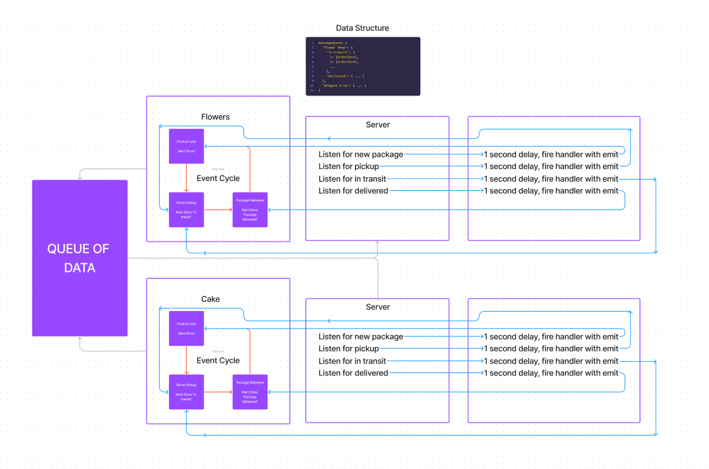

# LAB - 401-D49 Lab-13

## Project: CAPS

### Author: Lewis Benson

### Problem Domain

In Phase 3, we are building a set of features to help manage deliveries made by CAPS Drivers. This will simulate a delivery driver receiving a list of orders from a Queue and “scanning” package codes on delivery. Retailers will be able to see in their dashboard or log, a list of all packages delivered in real time. Should a delivery driver deliver many packages while the retailer is not connected to the dashboard, the vendor client should be guaranteed to receive “delivery” notifications from the Queue system.

Here are the high level stories related to this new set of requirements.

As a vendor, I want to “subscribe” to “delivered” notifications so that I know when my packages are delivered.
As a vendor, I want to “catch up” on any “delivered” notifications that I might have missed so that I can see a complete log.
As a driver, I want to “subscribe” to “pickup” notifications so that I know what packages to deliver.
As a driver, I want to “catch up” on any “pickup” notifications I may have missed so that I can deliver everything.
As a driver, I want a way to “scan” a delivery so that the vendors know when a package has been delivered.
And as developers, here are some of the development stories that are newly relevant to the above.

As a developer, I want to create a system of tracking who is subscribing to each event.
As a developer, I want to place all inbound messages into a “queue” so that my application knows what events are to be delivered.
As a developer, I want to create a system for communicating when events have been delivered and received by subscribers.
As a developer, I want to delete messages from the queue after they’ve been received by a subscriber, so that I don’t re-send them.
As a developer, I want to create a system for allowing subscribers to retrieve all undelivered messages in their queue.

### Links and Resources

- [ci/cd](https://github.com/tm-LBenson/caps/actions) (GitHub Actions)
- [server-prod]()

### Setup

`npm i` to install dependencies

#### `.env` requirements

there are no env requirements, the port is hardcoded to 3001 in hub.js

#### How to initialize/run your application (where applicable)

Using 4 terminals run:

- nodemon src/hub.js
- nodemon venders/cake/cake.js
- nodemon venders/flowers/flowers.js
  -nodemon driver/driver.js

#### Features / Routes

- Feature one:
  Creates a package in cake store
  Creates package in flowers store
  adds package to pickup queue
  moves package to delivery queue
  delivers package
  thanks driver

#### Tests

- How do you run tests?
  - npm test
- Any tests of note?

#### UML

