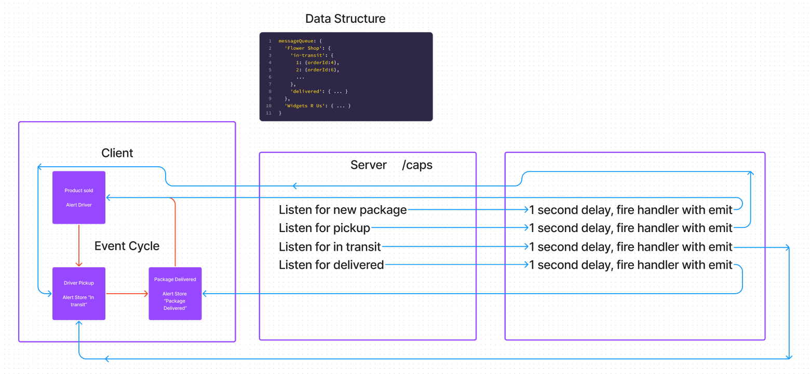

# LAB - 401-D49 Lab-11

## Project: CAPS

### Author: Lewis Benson

### Problem Domain

The core functionality we’ve already built remains the same. The difference in this phase is that we’ll be creating a networking layer. As such, the user stories that speak to application functionality remain unchanged, but our developer story changes to reflect the work needed for refactoring.

As a vendor, I want to alert the system when I have a package to be picked up.
As a driver, I want to be notified when there is a package to be delivered.
As a driver, I want to alert the system when I have picked up a package and it is in transit.
As a driver, I want to alert the system when a package has been delivered.
As a vendor, I want to be notified when my package has been delivered.

### Links and Resources

- [ci/cd](https://github.com/tm-LBenson/caps/actions) (GitHub Actions)
- [server-prod]()

### Setup

`npm i` to install dependencies
`nodemon` to start server on port 3001

#### `.env` requirements

see `.env.sample`

#### How to initialize/run your application (where applicable)

- `node newpackage.js`
  - this starts generating packages
- `node src/client.js`
  - this will fire off the listeners for the sockets and begin the delivery cycle
  - both vender and driver are in the clients file

#### Features / Routes

- Feature one: Deploy to Prod

#### Tests

- How do you run tests?
  - npm test
- Any tests of note?

#### UML

