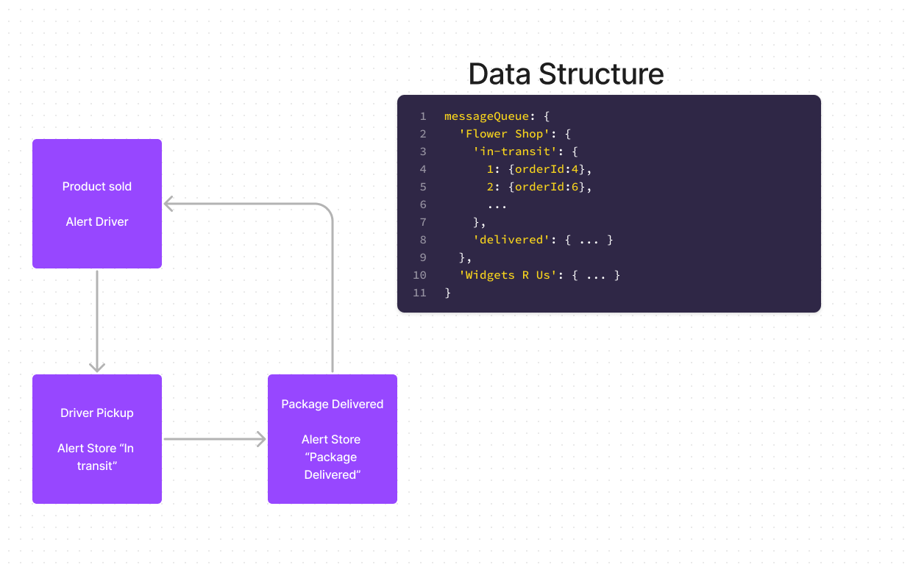

# LAB - 401-D49 Lab-11

## Project: CAPS

### Author: Lewis Benson

### Problem Domain

Today, we begin the first of a 4-Phase build of the CAPS system, written in Node.js. In this first phase, our goal is to setup a pool of events and handler functions, with the intent being to refactor parts of the system throughout the week, but keep the handlers themselves largely the same. The task of “delivering a package” doesn’t change (the handler), even if the mechanism for triggering that task (the event) does.
The following user/developer stories detail the major functionality for this phase of the project.

As a vendor, I want to alert the system when I have a package to be picked up.
As a driver, I want to be notified when there is a package to be delivered.
As a driver, I want to alert the system when I have picked up a package and it is in transit.
As a driver, I want to alert the system when a package has been delivered.
As a vendor, I want to be notified when my package has been delivered.
And as developers, here are some of the development stories that are relevant to the above.

As a developer, I want to use industry standards for managing the state of each package.
As a developer, I want to create an event driven system so that I can write code that happens in response to events, in real time.

### Links and Resources

- [ci/cd](https://github.com/d49-lab-09/caps/actions) (GitHub Actions)
- [server-prod]()

### Setup

`npm i` to install dependencies
`nodemon` to start server on port 3001

#### `.env` requirements

see `.env.sample`

#### How to initialize/run your application (where applicable)

- nodemon

#### Features / Routes

- Feature one: Deploy to Prod

#### Tests

- How do you run tests?
  - npm test
- Any tests of note?

#### UML

